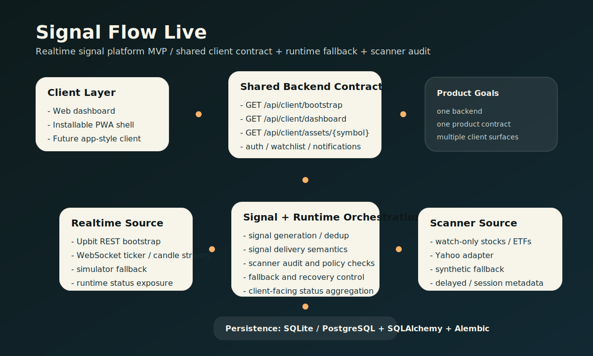
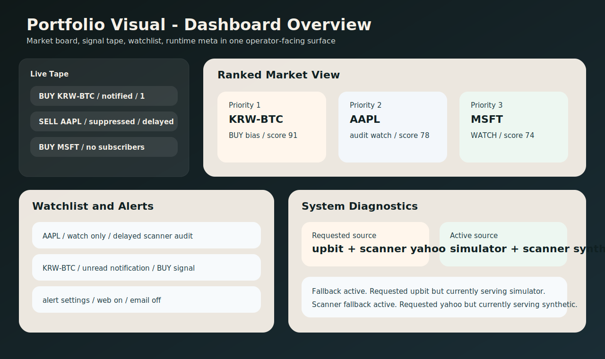
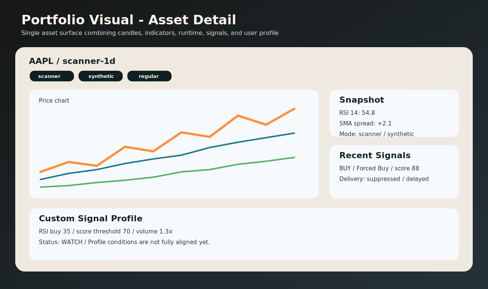
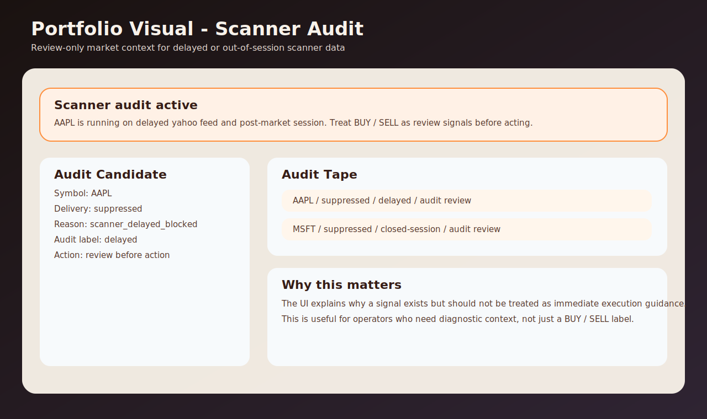
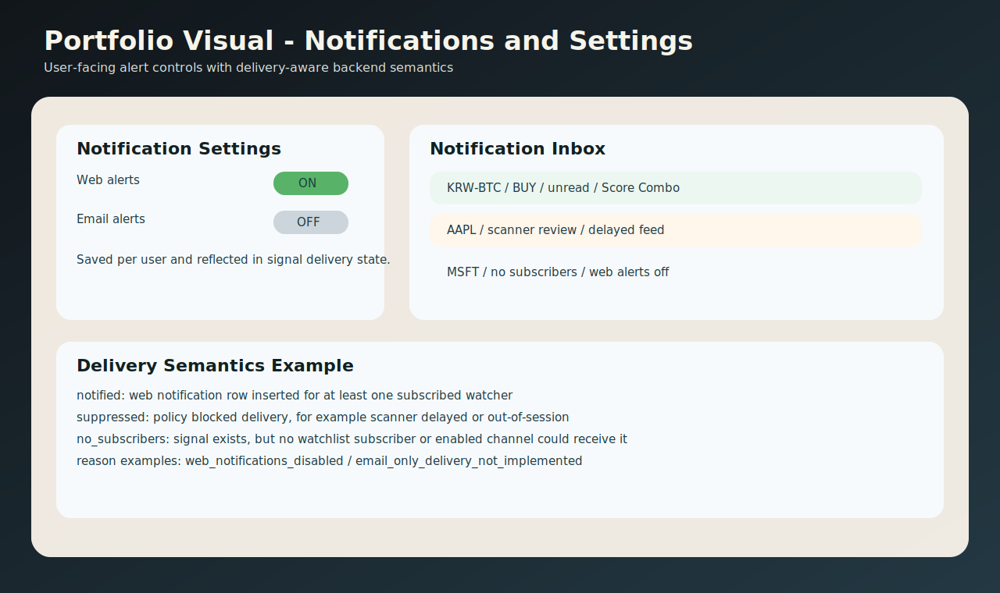

# Signal Flow Live 포트폴리오 소개

[English README](README.md)



## 한 줄 소개

Signal Flow Live는 실시간 암호화폐 시세와 scanner 기반 watch-only 주식/ETF 추적을 하나의 제품 경험으로 묶은 시장 신호 플랫폼 MVP입니다. FastAPI, SQLAlchemy, Alembic, WebSocket, PWA 기반으로 구현했고, web과 app-style client가 같은 백엔드 계약을 쓰도록 설계했습니다.

## 프로젝트 의도

이 프로젝트는 단순한 시세 조회 데모가 아니라, 아래 역량을 포트폴리오에서 보여주기 위해 만들었습니다.

- 실시간 데이터와 비실시간 scanner 데이터를 같은 제품 안에서 일관되게 다루는 백엔드 설계
- web, PWA, app client가 재사용할 수 있는 shared client contract 설계
- 외부 데이터 소스 장애를 전제로 한 fallback-safe runtime 설계
- 사용자 단위 watchlist, 알림, 인증, 마이그레이션, 배포 문서까지 포함한 실무형 구조

## 핵심 포인트

- 실시간 crypto는 Upbit REST bootstrap과 WebSocket 스트림으로 처리합니다.
- watch-only 주식/ETF는 scanner runtime으로 분리해 관리합니다.
- live source 실패 시 simulator fallback, scanner provider 실패 시 synthetic fallback을 지원합니다.
- `bootstrap`, `dashboard`, `asset detail` 중심의 shared API로 클라이언트 중복 구현을 줄였습니다.
- signal delivery를 `notified`, `suppressed`, `no_subscribers`로 나누고, 이유까지 기록합니다.
- SQLite 기본 구성이지만 PostgreSQL과 Alembic migration 경로를 같이 갖고 있습니다.

## 아키텍처 설명

이 시스템은 크게 네 층으로 나뉩니다.

1. Client layer
web dashboard, installable PWA, future app client가 같은 데이터 계약을 사용합니다.

2. Application layer
FastAPI가 인증, 시그널 생성, watchlist, notification, shared client payload 조합을 담당합니다.

3. Market data layer
실시간 Upbit stream과 scanner provider를 분리해 운영합니다. 둘은 runtime status와 fallback 정책으로 연결됩니다.

4. Persistence layer
assets, candles, signals, notifications, runtime_state를 DB에 저장하고, Alembic으로 스키마를 진화시킵니다.

## 내가 직접 해결한 문제

### 1. 클라이언트별 API 중복 문제

보통 web과 app를 따로 만들면 화면마다 필요한 데이터를 각자 조합하게 됩니다. 이 프로젝트에서는 아래 3개 endpoint를 shared contract로 잡아 client가 같은 형태의 payload를 바로 쓰도록 했습니다.

- `GET /api/client/bootstrap`
- `GET /api/client/dashboard`
- `GET /api/client/assets/{symbol}`

이 설계 덕분에 web과 app-style client가 같은 시작점과 같은 상태 모델을 공유할 수 있습니다.

### 2. 외부 데이터 소스 장애 대응

실시간 source는 언제든 깨질 수 있기 때문에, 실패를 예외 상황이 아니라 정상 운영 시나리오로 봤습니다.

- Upbit source 실패 시 simulator fallback
- scanner provider 실패 시 synthetic fallback
- scanner fallback 이후 원래 provider 재시도
- runtime warning과 source status를 UI에서 바로 노출

즉, "장애가 나면 멈춘다"가 아니라 "품질을 낮춰서라도 계속 서비스한다"는 방향으로 설계했습니다.

### 3. signal delivery semantics 정교화

알림이 발생하지 않았을 때도 단순히 실패로 처리하지 않고, 왜 전달되지 않았는지를 시스템적으로 남기도록 설계했습니다.

- `suppressed`: 정책상 막힌 signal
- `no_subscribers`: 구독자나 전달 채널이 없는 signal
- `notification_delivery_reason`: 왜 전달되지 않았는지 설명

예를 들면:

- `scanner_delayed_blocked`
- `scanner_session_blocked:pre`
- `web_notifications_disabled`
- `email_only_delivery_not_implemented`

이 정보는 UI와 API에서 같이 노출되어, 운영자와 사용자 모두 상태를 해석할 수 있습니다.

## 주요 기능

- Upbit 실시간 시세/캔들 bootstrap
- WebSocket 기반 live stream
- watch-only scanner runtime
- Yahoo adapter 및 synthetic scanner provider
- scanner audit 표시
- 사용자 인증, refresh session, 비밀번호 재설정, 이메일 검증 기반
- watchlist와 notification settings
- 알림 inbox 및 read state
- 정적 web dashboard + PWA shell
- Alembic migration과 PostgreSQL 이행 기반

## 기술 스택

- Backend: FastAPI
- ORM / DB access: SQLAlchemy
- Migration: Alembic
- Database: SQLite, PostgreSQL-ready
- Streaming: WebSocket
- External client: httpx
- Test: pytest
- Frontend shell: static HTML, JS, PWA

## 검증 상태

현재 이 저장소 기준 로컬 테스트 상태:

- `58 passed`

테스트 범위에는 다음이 포함됩니다.

- client API contract
- scanner runtime / provider
- signal delivery policy
- web shell 정적 검증
- migration and database behavior

## 실행 방법

### Windows PowerShell

```powershell
cd "C:\Users\S-P-041\Downloads\signal-flow-mvp"
.\run-local.ps1
```

### macOS / Linux

```bash
cd signal-flow-mvp
python3 -m venv .venv
source .venv/bin/activate
pip install -r requirements.txt
uvicorn app.main:app --reload
```

브라우저에서 `http://127.0.0.1:8000`에 접속하면 됩니다.

데모 계정:

- username: `demo`
- password: `demo1234`

## 포트폴리오에 같이 넣으면 좋은 이미지

현재 문서에는 아키텍처 이미지를 먼저 포함해 두었고, 포트폴리오용 주요 화면 설명도 함께 정리했습니다.

### 1. 메인 대시보드



- 역할: 전체 시장 상태, 최근 signal flow, watchlist, runtime 상태를 한 화면에서 보여주는 진입 화면입니다.
- 구현 포인트: shared `dashboard` payload를 기반으로 여러 UI 블록이 한 번에 갱신되도록 설계했습니다.
- 전달 가치: 단순 시세판이 아니라 "실시간 신호 도구"라는 제품 성격을 가장 잘 보여주는 화면입니다.

### 2. 자산 상세 화면



- 역할: 특정 자산의 recent candles, signal history, snapshot indicator, custom profile 상태를 보여줍니다.
- 구현 포인트: `asset detail` API 하나로 차트, signal, profile, runtime 정보를 같이 공급합니다.
- 전달 가치: API 조합이 아니라 백엔드가 이미 "화면 단위 계약"을 제공한다는 점을 보여줍니다.

### 3. Scanner Audit 화면



- 역할: delayed feed, pre-market, post-market, closed-session 같은 review-only 상태를 강조해서 보여줍니다.
- 구현 포인트: signal delivery reason과 runtime metadata를 함께 노출해 "왜 즉시 action 대상이 아닌지" 설명합니다.
- 전달 가치: 기능 구현을 넘어서 운영/의사결정 보조 UX를 설계했다는 점을 보여줍니다.

### 4. 알림 및 설정 화면



- 역할: 사용자별 watchlist, notification inbox, delivery setting을 다룹니다.
- 구현 포인트: `no_subscribers`, `web_notifications_disabled`, `email_only_delivery_not_implemented` 같은 delivery semantics를 시스템적으로 남기고 보여줍니다.
- 전달 가치: 알림이 "왔다/안 왔다"가 아니라 "왜 그렇게 됐는지 설명 가능한 제품"이라는 점을 강조할 수 있습니다.

추천 방식은 "이미지 1장 + 설명 3줄"입니다.

- 이 화면이 무슨 역할인지
- 여기서 내가 구현한 핵심 로직이 무엇인지
- 사용자나 운영자가 이 화면에서 무엇을 판단할 수 있는지

## 기술적 의사결정

별도 문서로 정리해 두었습니다.

- [`docs/PORTFOLIO_DECISIONS_KO.md`](docs/PORTFOLIO_DECISIONS_KO.md)

이 문서에는 아래 내용을 담았습니다.

- 왜 shared client contract를 택했는지
- 왜 fallback을 핵심 구조로 가져갔는지
- signal delivery semantics를 왜 세분화했는지
- SQLite에서 PostgreSQL로 확장할 때 어떤 점을 고려했는지

## 트러블슈팅

문제 해결 사례도 별도 문서로 정리했습니다.

- [`docs/TROUBLESHOOTING_KO.md`](docs/TROUBLESHOOTING_KO.md)

포트폴리오에서 특히 보여주기 좋은 사례는 다음입니다.

- scanner fallback 이후 원래 provider를 다시 복구하는 문제
- 날짜 변화에 따라 깨지는 테스트를 시간 고정 방식으로 안정화한 문제
- signal feed 필터링 시 최근 N개만 잘라 오래된 유효 신호를 놓치던 문제

## 저장소 리뷰 포인트

이 프로젝트를 코드 관점에서 본다면 아래 파일을 우선 보면 됩니다.

- `app/client_api.py`
- `app/runtime.py`
- `app/scanner_runtime.py`
- `app/signal_service.py`
- `app/db.py`
- `static/index.html`
- `alembic/`

## 관련 문서

- 배포 로드맵: [`docs/DEPLOYMENT_ROADMAP.md`](docs/DEPLOYMENT_ROADMAP.md)
- HTTPS 배포 가이드: [`docs/HTTPS_DEPLOYMENT_GUIDE.md`](docs/HTTPS_DEPLOYMENT_GUIDE.md)
- PWA 릴리즈 가이드: [`docs/PWA_RELEASE_GUIDE.md`](docs/PWA_RELEASE_GUIDE.md)
- PostgreSQL 로컬 설정: [`docs/POSTGRESQL_LOCAL_SETUP.md`](docs/POSTGRESQL_LOCAL_SETUP.md)
- 기술적 의사결정: [`docs/PORTFOLIO_DECISIONS_KO.md`](docs/PORTFOLIO_DECISIONS_KO.md)
- 트러블슈팅: [`docs/TROUBLESHOOTING_KO.md`](docs/TROUBLESHOOTING_KO.md)
